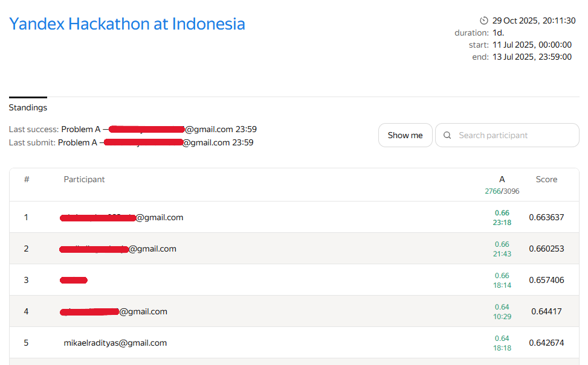
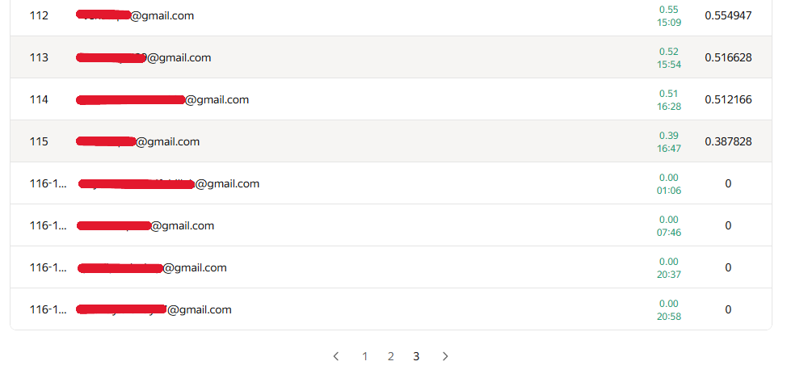

# 🏆 Yandex Hackathon Indonesia 2025 — Travel Time Prediction

Proyek ini merupakan hasil submission saya pada **Yandex Hackathon in Indonesia 2025**, yang diselenggarakan oleh **Techready.id** dan **Digital Talent Scholarship (DTS)**.  
Tugas utama dalam kompetisi ini adalah **memprediksi waktu perjalanan (`travel_time`)** berdasarkan fitur-fitur terkait lalu lintas, waktu, dan kondisi wilayah.

---

## 📊 Dataset

Dataset terdiri dari:

- 40.000 data latih  
- 3.000 data uji  

Fitur utama:
- `start_point`, `end_point`  
- `time_of_day`, `day_of_week`  
- `traffic_condition`, `event_count`, `is_holiday`  
- `vehicle_density`, `population_density`  
- `weather`, `public_transport_availability`  
- `historical_delay_factor`  
- **Target:** `travel_time`

---

## 🧠 Pendekatan

### 1. EDA (Exploratory Data Analysis)
Dilakukan pada **`eda_data.py`** untuk memahami struktur data, mendeteksi *missing values*, serta menentukan strategi preprocessing.

### 2. Eksperimen Model (`model_selection.py`)
Menguji beberapa model baseline dan pembanding:

- Linear Regression  
- Ridge, Lasso, ElasticNet  
- SGDRegressor  

Evaluasi dilakukan menggunakan metrik **R² (Coefficient of Determination)**.

### 3. Model Final (`final_submission.py`)
Model terbaik adalah **SGDRegressor** dengan konfigurasi `loss='huber'`, serta beberapa tahapan *feature engineering*:

- Pembuatan fitur baru: `route` dan `same_area`  
- Transformasi log pada target dan fitur yang *skewed*  
- Pipeline lengkap: imputasi, encoding, dan scaling

---

## 🏁 Hasil Kompetisi

- **Kompetisi:** Yandex Hackathon in Indonesia (Techready.id × DTS × Yandex)  
- **Tanggal:** 11–13 Juli 2025  
- **Tugas:** Prediksi waktu perjalanan (travel time prediction)  
- **Metrik:** R² Score  
- **Peringkat Akhir:** 🥇 **Top 5 dari 100+ peserta**  
- **Skor Terbaik:** `0.642674` (menggunakan SGDRegressor)

---

## 📊 Papan Peringkat Akhir

Bagian atas klasemen:



Bagian bawah klasemen:



---

## ⚙️ Teknologi yang Digunakan

- Python 3.9  
- Pandas, NumPy  
- Scikit-learn  
- Matplotlib, Seaborn  
- Jupyter Notebook   

---

## 📂 Struktur Proyek
```plaintext
yandex-hackathon-travel-time/
│
├── asset/              # berisi file gambar informasi tambahan
├── data/               # berisi train dan test sample
├── notebooks/          # eksplorasi dan eksperimen
├── src/                # script utama (EDA, modeling, final)
├── submission/         # hasil prediksi
├── README.md
├── .gitignore
└── requirements.txt
