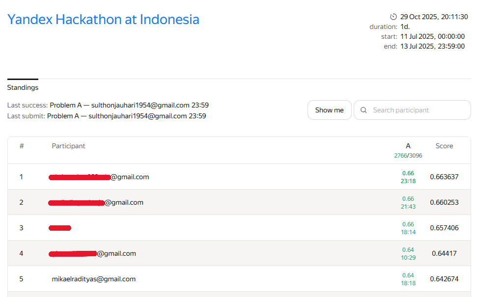

# 🏆 Yandex Hackathon Indonesia 2025 — Travel Time Prediction

Proyek ini merupakan submission saya pada **Yandex Hackathon in Indonesia 2025**, diselenggarakan oleh **Techready.id** dan **Digital Talent Scholarship (DTS)**.  
Tugas utama adalah memprediksi **travel_time** berdasarkan fitur-fitur lalu lintas, waktu, dan kondisi wilayah.

---

## 📊 Dataset
Dataset berisi:
- 40.000 data latih
- 3.000 data uji

Fitur utama:
- `start_point`, `end_point`
- `time_of_day`, `day_of_week`
- `traffic_condition`, `event_count`, `is_holiday`
- `vehicle_density`, `population_density`
- `weather`, `public_transport_availability`
- `historical_delay_factor`

Target: `travel_time`

---

## 🧠 Pendekatan
1. **EDA (Exploratory Data Analysis)**  
   Dilakukan pada `eda_data.py` untuk memahami struktur data, missing values, dan rekomendasi preprocessing.

2. **Eksperimen Model (model_selection.py)**  
   Menggunakan model baseline dan pembanding:
   - Linear Regression  
   - Ridge, Lasso, ElasticNet  
   - SGDRegressor  
   Evaluasi menggunakan metrik **R² (Coefficient of Determination)**.

3. **Model Final (final_submission.py)**  
   Menggunakan model **SGDRegressor dengan konfigurasi loss='huber'**, disertai feature engineering:
   - Fitur baru: `route` dan `same_area`
   - Log-transform target dan fitur yang skewed
   - Pipeline preprocessing lengkap dengan imputasi, encoding, dan scaling

---

## 🏆 Competition Results

- **Competition:** Yandex Hackathon in Indonesia (Techready.id x DTS x Yandex)  
- **Date:** 11–13 July 2025  
- **Task:** Predict travel time from city traffic dataset  
- **Metric:** R² Score  
- **Final Rank:** 🥇 Top 5 (out of 100+ participants)  
- **Best Score:** 0.642674 (SGDRegressor)

---

## 📊 Final Standings

---

## ⚙️ Teknologi yang Digunakan
- Python 3.9  
- Pandas, NumPy  
- Scikit-learn  
- Matplotlib, Seaborn  
- Jupyter Notebook  

---

## 📂 Struktur Proyek
yandex-hackathon-travel-time/
│
├── data/ # berisi train dan test sample
├── notebooks/ # eksplorasi dan eksperimen
├── src/ # script utama (EDA, modeling, final)
├── submission/ # hasil prediksi
├── README.md
├── .gitignore
└── requirements.txt